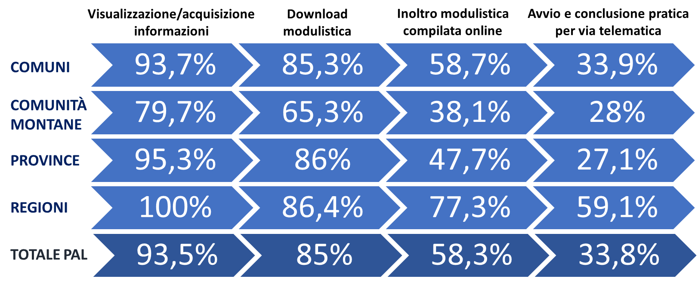

.. _h1c345641b5d67585127b1c5574b69:

1. SERVIZI PUBBLICI DIGITALI IN ITALIA: LO SCENARIO ATTUALE
###########################################################

.. _h1348797e2c1b395c471e235d2332287d:

1.1 Diffusione e utilizzo dei servizi pubblici digitali: l’Italia nel contesto europeo
**************************************************************************************

Anche nel 2017, i dati sulla di diffusione dei servizi online offerti dalle pubbliche amministrazioni hanno confermato le prestazioni altalenanti degli enti pubblici italiani rispetto agli omologhi europei.

Il \ |STYLE0|\ \ [#F1]_\ , pubblicato ad inizio anno dalla Commissione Europea, vede l’Italia registrare prestazioni inferiori alla media UE alla voce \ |STYLE1|\ , rispetto al quale il nostro Paese ricopre la 21° posizione nella UE a 28, ben quattro posizioni in meno rispetto ai dati della precedente rilevazione.

Sul lato dell’offerta, pur non mantenendo il passo con il miglioramento dei servizi di governo elettronico in altri paesi, l’Italia si conferma comunque al di sopra della media UE per \ |STYLE2|\  (voce \ |STYLE3|\ ), seppur a fronte di una discesa dalla 14° alla 16° posizione nella UE a 28.

prova immagine

|REPLACE1|

prova testo colorato

|REPLACE2|

Ma è sul lato della domanda che l’Italia manifesta ancora le maggiori difficoltà. Secondo il DESI 2017, l’Italia si attesta alla terz’ultima posizione (25°) per \ |STYLE4|\ , una in meno della precedente rilevazione, con il 16% di utenti sul totale di utilizzatori di internet, a fronte di una media europea del 34%.

Dati che confermano quindi la tendenza andatasi consolidando negli ultimi anni, che vede l’Italia come il Paese europeo con il \ |STYLE5|\  

.. _h774e33f175a556924502d3b1867547a:

1.2 Un focus sugli enti locali: il rapporto ISTAT sulle tecnologie ICT nella PAL
********************************************************************************

Il \ |STYLE6|\  (gennaio 2017)\ [#F2]_\  fornisce una fotografia piuttosto puntuale della situazione attuale. Dai dati sulla disponibilità di servizi on-line emerge in particolare che: 

* il 93,5% delle Amministrazioni consente agli utenti l’accesso a servizi ad un livello base di visualizzazione e/o acquisizione di informazioni;

* l’85% dichiara la possibilità di scaricare modulistica;

* il 58,3% consente l’inoltro della modulistica on-line;

* \ |STYLE7|\ . 

\ |IMG1|\ 

Nota: I quattro livelli di disponibilità on-line dei servizi sono considerati come livelli progressivi: l'ente che ha indicato, ad esempio, di rendere disponibile on-line un livello di acquisizione di modulistica, è stato considerato come rispondente anche al livello precedente di visualizzazione di informazioni.

.. _h402e1b66175c44354f636a5932e64f:

1.3 Lo stato di avanzamento delle Piattaforme per la Cittadinanza digitale
**************************************************************************

A complicare il quadro, le difficoltà che ancora oggi caratterizzano la diffusione delle Piattaforme abilitanti nazionali, in primis ANPR, SPID e PagoPA, il cui completo dispiegamento consentirebbe a tutte le amministrazioni di usufruire di funzionalità trasversali e riusabili nei singoli progetti, accelerando e uniformando lo sviluppo di servizi digitali per il cittadino e l’impresa. 

Il caso di \ |STYLE8|\  è in questo senso emblematico. Con oltre 3.800 amministrazioni aderenti (già superato nel 2017 il target di 3.000 enti stabilito per il 2018) e più di 4.300 servizi abilitati, SPID registra ancora gravi ritardi dal punto di vista delle identità digitali rilasciate. Dopo il boom di inizio anno, legato all’obbligo per docenti e neo-diciottenni di dotarsi di una ID per poter usufruire dei bonus cultura, il numero di identità SPID è cresciuto in maniera costante, attestandosi a oltre di 2 milioni a dicembre 2017, ancora lontanissimo livelli attesi: sono infatti un miraggio i 10 milioni di utenti previsti per la fine del 2017 dal Primo Rapporto di monitoraggio sull’Agenda per la semplificazione (aprile 2015)\ [#F3]_\ .

.. _h61784958774e33584e6c26a68b6514:

1.4. Le principali novità del 2017 in tema di servizi online
************************************************************

.. _h707156721f6812225c19286c257e7f3a:

Le iniziative di AgID e Team Digitale
=====================================

Per far fronte alla situazione sopra descritta, nel 2017 AgID e Team Digitale hanno avviato una serie di azioni volte semplificare lo sviluppo e l’utilizzo dei servizi online delle amministrazioni attraverso la definizione di regole comuni per la progettazione di interfacce, servizi e contenuti. Ne sono testimonianza la nascita delle community \ |STYLE9|\  (marzo) e \ |STYLE10|\  (giugno) e l'aggiornamento delle \ |STYLE11|\  (ottobre), azioni descritte dal \ |STYLE12|\  (Capitolo 7 - \ |STYLE13|\ ), cui seguirà il potenziamento continuo degli strumenti digitali a supporto delle community e la realizzazione di linee guida e \ |STYLE14|\  utili allo sviluppo di applicazioni e servizi digitali della PA.

Tali iniziative si muovono tutte verso un unico obiettivo: migliorare l’esperienza del cittadino nella sua interazione digitale con l’amministrazione. Azioni che segnano forse un punto di svolta verso il miglioramento dell’offerta pubblica di servizi online e che, pur muovendosi nel solco delle iniziative precedentemente avviate, portano l’impronta evidente del Team guidato da Piacentini. Team cui va riconosciuto il merito di aver rimesso i temi dell’usabilità e dell’accessibilità al centro dell’azione di governo, introducendo però elementi di profonda discontinuità rispetto al passato, a partire dalla costituzione e dallo sviluppo delle comunità di pratica di sviluppatori e \ |STYLE15|\  a supporto delle PA, a dimostrazione della grande importanza riconosciuta ai processi di innovazione “dal basso”.

Lo sviluppo di servizi digitali pubblici verrà inoltre supportato da altre azioni previste del Piano triennale, a partire dal potenziamento e dalla diffusione delle Piattaforme abilitanti, attraverso l'evoluzione di quelle già operative ma non ancora utilizzate da tutte le PA (SPID e PagoPA), il completamento di quelle maggiormente in ritardo (ANPR) e la messa in esercizio di nuovi strumenti (ComproPA, Siope+, ecc.).

Le iniziative volte al miglioramento della \ |STYLE16|\  del cittadino e le azioni finalizzate alla diffusione delle Piattaforme abilitanti promettono di apportare un beneficio immediato in termini di miglioramento dell'offerta di servizi pubblici digitali. Sono però molte le azioni previste dal Piano triennale che racchiudono in loro le potenzialità per produrre impatti notevoli sull’interazione digitale tra amministrazioni e cittadini. Tra queste, rientra sicuramente la transizione al \ |STYLE17|\  basato sull’approccio API \ |STYLE18|\ . Affinché i servizi digitali della PA siano sempre più efficienti e fruibili, è infatti necessario abilitare il dialogo e la condivisione delle informazioni inerenti cittadini e imprese detenute dai diversi enti, in modo da rendere all’utenza il servizio forse più importante: evitare di chiedere più volte informazioni già fornite in passato (vedi capitolo 4).

.. _h633d4e4b506c5f4d2a48212357141:

Il correttivo al Codice dell’Amministrazione Digitale
=====================================================

Direttamente collegato al Piano Triennale è la recente modifica del \ |STYLE19|\  del dicembre 2017\ [#F4]_\ . Resosi necessario per adeguare l'architettura normativa al modello organizzativo e tecnologico definito dal Piano triennale, il correttivo introduce importanti novità inerenti molti aspetti legati al tema della “cittadinanza digitale” intervenendo, tra le altre cose, su domicilio digitale, SPID, PagoPA, e banche dati di interesse nazionale. 

Sebbene l’ennesima revisione del Codice sia ancora caratterizzata da alcuni elementi di debolezza - su tutti, la mancata introduzione di meccanismi di premialità e sanzione legati all’effettiva attuazione del Codice, un principio sancito dalla stessa “riforma Madia”, ma rimasto ancora sostanzialmente inattuato per ciò che attiene il digitale -  è impossibile negare che il correttivo si muova nella giusta direzione, ovvero nel segno di una profonda semplificazione nel dialogo con il cittadino, in particolare per quanto attiene il \ |STYLE20|\ , principale “protagonista” della riforma (vedi capitolo 3.4). 

.. bottom of content

.. |STYLE0| replace:: **rapporto DESI 2017**

.. |STYLE1| replace:: **servizi pubblici digitali**

.. |STYLE2| replace:: **disponibilità dei servizi pubblici online**

.. |STYLE3| replace:: *completamento dei servizi online*

.. |STYLE4| replace:: **utenti dei servizi di governo elettronico**

.. |STYLE5| replace:: **divario maggiore tra disponibilità dei servizi on line e il loro utilizzo da parte di cittadini e imprese.**

.. |STYLE6| replace:: **rapporto ISTAT sulle tecnologie ICT nella PA locale**

.. |STYLE7| replace:: **soltanto il 33,8% permette l’avvio e la conclusione per via telematica dell’intero iter relativo al servizio richiesto**

.. |STYLE8| replace:: **SPID**

.. |STYLE9| replace:: **Developers Italia**

.. |STYLE10| replace:: **Designers Italia**

.. |STYLE11| replace:: **Linee guida di design per i servizi e i siti della PA**

.. |STYLE12| replace:: **Piano Triennale per l'ICT**

.. |STYLE13| replace:: *Strumenti per la generazione e la diffusione di servizi digitali*

.. |STYLE14| replace:: *toolkit*

.. |STYLE15| replace:: *designer*

.. |STYLE16| replace:: *user experience*

.. |STYLE17| replace:: **nuovo modello di interoperabilità**

.. |STYLE18| replace:: *first*

.. |STYLE19| replace:: **Codice dell'Amministrazione Digitale**

.. |STYLE20| replace:: **domicilio digitale**

.. |REPLACE1| raw:: html

    
.. |REPLACE2| raw:: html

    
prova testo colorato

.. rubric:: Footnotes

.. [#f1]   `https://ec.europa.eu/digital-single-market/en/desi <https://ec.europa.eu/digital-single-market/en/desi>`__ 
.. [#f2]   `https://www.istat.it/it/archivio/195035 <https://www.istat.it/it/archivio/195035>`__ 
.. [#f3]   `http://www.italiasemplice.gov.it/media/2161/agendasemplificazione_report3042015.pdf <http://www.italiasemplice.gov.it/media/2161/agendasemplificazione_report3042015.pdf>`__ 
.. [#f4]   `http://www.gazzettaufficiale.it/eli/id/2018/01/12/18G00003/sg <http://www.gazzettaufficiale.it/eli/id/2018/01/12/18G00003/sg>`__ 

